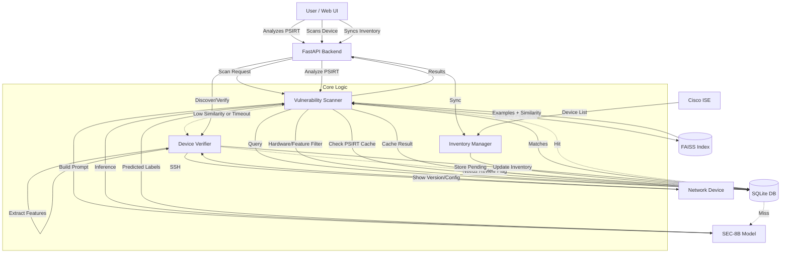

# PSIRT Vulnerability Analysis & Device Verification System

**Version 4.5** | December 2025

A comprehensive system for analyzing Cisco PSIRTs (Product Security Incident Response Team advisories) and verifying network device vulnerability exposure.

> **What's New in v4.5:** Distribution-ready cleanup, security hardening (redacted exposed credentials), multi-platform LoRA adapters (Mac MLX + Linux CUDA). See **[CLAUDE.md](CLAUDE.md)** for full changelog.

## Quick Start

### Prerequisites

- Python 3.9+
- Node.js 18+ (for frontend)
- ~32GB RAM (for Foundation-Sec-8B model on Mac) or GPU with 16GB+ VRAM

### Setup

**Option A: Mac (Apple Silicon M1/M2/M3)**
```bash
# One-time setup (~5 min)
./setup_mac_env.sh

# Start backend (background)
source venv_mac/bin/activate
nohup ./backend/run_server.sh > backend.log 2>&1 &

# Start frontend
cd frontend && npm install && npm run dev
```

**Option B: Linux (NVIDIA GPU / CPU)**
```bash
# One-time setup (~5 min)
./setup_linux_env.sh

# Start backend (background)
source venv/bin/activate
nohup ./backend/run_server.sh > backend.log 2>&1 &

# Start frontend
cd frontend && npm install && npm run dev
```

> **Tips:** Backend logs are in `backend.log`. To stop: `pkill -f uvicorn` or `Ctrl+C` for frontend.

### Access

- **Frontend UI:** http://localhost:3000
- **API Documentation:** http://localhost:8000/docs

## Features

### ✅ Production Ready

| Feature | Description |
|---------|-------------|
| **PSIRT Analysis** | Foundation-Sec-8B LLM predicts vulnerability labels (~71% Mac, ~57% Linux) |
| **Database Scanning** | Fast defect lookup (9,700+ Known Issues, 1-6ms queries) |
| **Hardware Filtering** | Filter by device model (25% false positive reduction) |
| **Feature-Aware Scanning** | Filter by configured features (40-80% false positive reduction) |
| **Device Verification** | SSH to live devices or use JSON snapshots |
| **ISE Integration** | Import devices from Cisco ISE for bulk scanning |
| **Export** | CSV, PDF, JSON reports |

### 🔧 Key Capabilities

1. **Two Analysis Paths:**
   - **Path A:** Paste PSIRT summary → LLM predicts labels → Verify on device
   - **Path B:** Enter version/hardware → Database scan → Get vulnerability list

2. **Three-Tier PSIRT Caching:**
   - Database cache (<10ms)
   - FAISS exact match (~30ms)
   - LLM inference (~3-4s)

3. **Air-Gapped Support:**
   - Extract features on secure network
   - Verify offline with JSON snapshots

## Documentation

📚 **Start here:** See [CLAUDE.md](CLAUDE.md) for complete technical documentation.

| Document | Purpose |
|----------|---------|
| [CLAUDE.md](CLAUDE.md) | Complete project guide (START HERE) |
| [docs/ADDING_LABELED_DATA.md](docs/ADDING_LABELED_DATA.md) | Data ingestion & offline updates |
| [docs/AIR_GAP_DEPLOYMENT.md](docs/AIR_GAP_DEPLOYMENT.md) | Air-gapped deployment guide |
| [backend/db/README_VULN_DB.md](backend/db/README_VULN_DB.md) | Database schema |
| [sidecar_extractor/README.md](sidecar_extractor/README.md) | Air-gapped feature extraction |

## Data Updates (New V2 Pipeline)

Keep your vulnerability database fresh with our integrated offline updater.

1.  **Fetch & Label**: Use the AI-powered packager to fetch latest Cisco data, label it using the local LLM, and package it.
    ```bash
    # Fetch 20 new items and package them
    python scripts/cisco_vuln_fetcher.py --mode latest --count 20 -o fresh.json
    python scripts/offline_update_packager.py --input fresh.json --output update.zip
    ```
2.  **Apply Update**: Ingest the package into the SQLite database.
    ```bash
    python scripts/apply_offline_update.py --package update.zip
    ```

## Architecture



> [!IMPORTANT]
> **MAINTENANCE REQUIREMENT**
> For detailed architecture, workflow diagrams, and component dependencies, see **[docs/ARCHITECTURE_AND_WORKFLOW.md](docs/ARCHITECTURE_AND_WORKFLOW.md)**.
> This documentation **MUST** be updated whenever the system architecture or workflow changes.

## Test the API

```bash
# PSIRT Analysis
curl -X POST http://localhost:8000/api/v1/analyze-psirt \
  -H "Content-Type: application/json" \
  -d '{"summary": "SNMP vulnerability allows DoS", "platform": "IOS-XE"}'

# Database Scan (version + hardware + features)
curl -X POST http://localhost:8000/api/v1/scan-device \
  -H "Content-Type: application/json" \
  -d '{
    "platform": "IOS-XE",
    "version": "17.10.1",
    "hardware_model": "Cat9300",
    "features": ["MGMT_SSH_HTTP", "SEC_CoPP"]
  }'
```

## Project Structure

```
├── backend/              # FastAPI application
├── frontend/             # React + TypeScript UI
├── sidecar_extractor/    # Air-gapped feature extraction
├── taxonomies/           # Feature definitions (IOS-XE, IOS-XR, ASA, etc.)
├── models/               # FAISS index + training data
├── vulnerability_db.sqlite  # Known Issues DB (9.7k entries)
└── CLAUDE.md             # Complete documentation
```

## Performance

| Metric | Value |
|--------|-------|
| Model Accuracy | ~71% (Mac/MLX), ~57% (Linux/CUDA) |
| Database Scan | 1-6ms |
| PSIRT Cache Hit | <10ms |
| Supported Platforms | IOS-XE, IOS-XR, ASA, FTD, NX-OS |
| Total Database Records | 9,705 (9,617 bugs + 88 PSIRTs) |

---

**Last Updated:** December 22, 2025 | **Version:** 4.5
