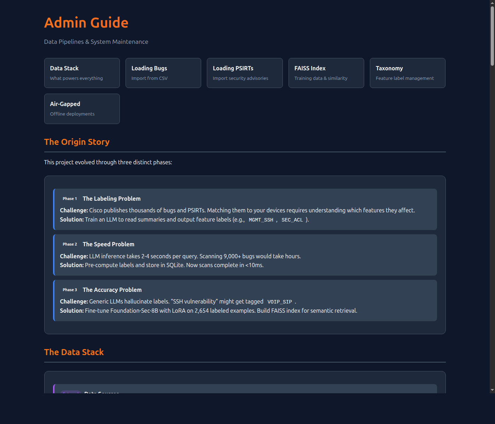
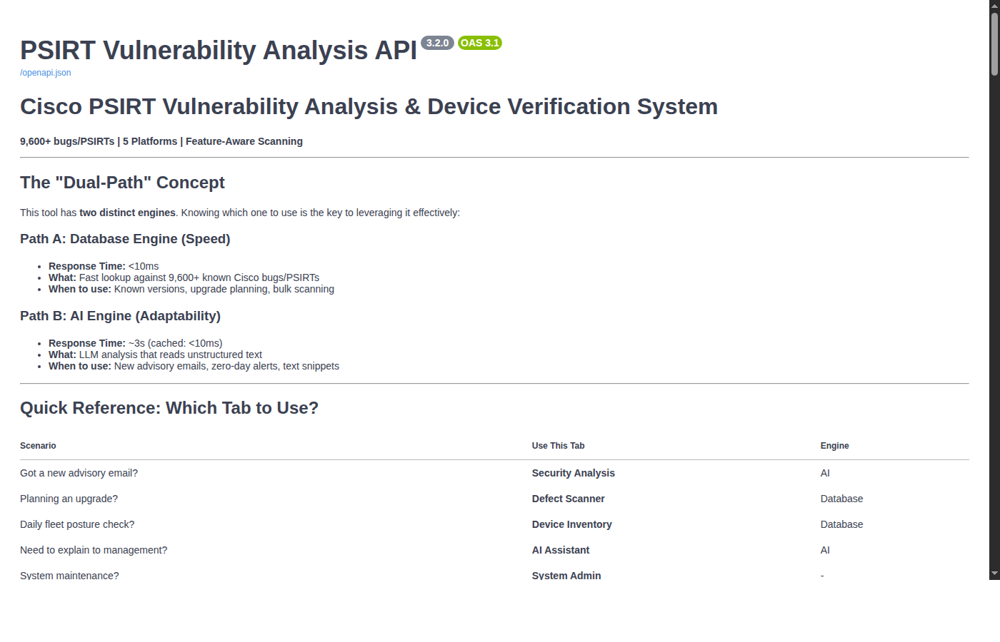

# Admin Guide: Data Pipelines & System Maintenance

This guide explains how we got here, what powers the system, and how to keep it running.

> **Interactive Version:** Access this guide as a styled HTML page at [`http://localhost:8000/api/v1/admin-guide`](http://localhost:8000/api/v1/admin-guide)
>
> 

## The Origin Story: How We Got Here

This project evolved through three distinct phases:

### Phase 1: The Labeling Problem
**Challenge:** Cisco publishes thousands of bugs and PSIRTs. Matching them to *your* devices requires understanding which *features* they affect.

**Solution:** Train an LLM to read a bug/PSIRT summary and output feature labels (e.g., `MGMT_SSH`, `SEC_ACL`, `L3_BGP`).

### Phase 2: The Speed Problem
**Challenge:** LLM inference takes 2-4 seconds per query. Scanning 9,000+ bugs would take hours.

**Solution:** Pre-compute labels and store them in SQLite. Now scans complete in <10ms.

### Phase 3: The Accuracy Problem
**Challenge:** Generic LLMs hallucinate labels. "SSH vulnerability" might get tagged `VOIP_SIP`.

**Solution:** Fine-tune Foundation-Sec-8B with LoRA on 2,654 labeled examples. Build FAISS index for semantic retrieval.

---

## The Data Stack: What Powers Everything

```
┌──────────────────────────────────────────────────────────────────┐
│                     DATA SOURCES (External)                      │
├──────────────────────────────────────────────────────────────────┤
│  Cisco Bug Search Tool    →  bugs/*.csv (20,000+ bugs)           │
│  Cisco Security Advisories →  output/psirts.json (88 PSIRTs)     │
│  Human Labeling           →  golden_dataset.csv (2,654 examples) │
└──────────────────────────────────────────────────────────────────┘
                              │
                              ▼
┌──────────────────────────────────────────────────────────────────┐
│                     PROCESSING LAYER                             │
├──────────────────────────────────────────────────────────────────┤
│  load_bugs.py       →  Parse CSV, detect version patterns        │
│  load_psirts.py     →  Parse JSON, map severity                  │
│  build_faiss_index  →  Embed summaries, create vector store      │
└──────────────────────────────────────────────────────────────────┘
                              │
                              ▼
┌──────────────────────────────────────────────────────────────────┐
│                     RUNTIME ASSETS                               │
├──────────────────────────────────────────────────────────────────┤
│  vulnerability_db.sqlite   →  9,617 bugs + 88 PSIRTs             │
│  models/faiss_index.bin    →  2,654 embedded examples            │
│  models/lora_adapter/      →  Fine-tuned LoRA weights            │
│  taxonomies/features*.yml  →  141 feature definitions            │
└──────────────────────────────────────────────────────────────────┘
```

---

## Path 1: Loading Bug Data

**Scenario:** You have a new CSV export from Cisco Bug Search Tool.

**Step 1:** Place the CSV in the project directory.

**Step 2:** Run the loader with platform specification.

```bash
python backend/db/load_bugs.py Cat9Kbugs_IOSXE_17.csv --platform IOS-XE
```

**Step 3:** Verify the load.

```bash
python backend/db/get_last_update.py
```

> [!TIP]
> **Incremental Updates:** The loader skips duplicates by default. Re-running with the same CSV is safe and fast.

**Expected CSV Columns:**
| Column | Purpose |
|--------|---------|
| `BUG Id` | CSCxxx12345 identifier |
| `BUG headline` | Short description |
| `Bug Severity` | 1=Critical, 2=High, 3=Medium, 4=Low |
| `Known Affected Release(s)` | Version strings (e.g., "17.10.1 17.11.2") |
| `Known Fixed Releases` | First fixed version |

---

## Path 2: Loading PSIRT Data

**Scenario:** You want to add new Cisco Security Advisories.

**Step 1:** Export PSIRTs to `output/psirts.json` (see Cisco API docs).

**Step 2:** Run the PSIRT loader.

```bash
python backend/db/load_psirts.py
```

> [!IMPORTANT]
> PSIRTs require platform assignment. The loader reads the `platform` field from JSON. Ensure your export includes platform metadata.

**JSON Structure:**
```json
{
  "advisoryId": "cisco-sa-2024-iosxe-webui",
  "summary": "A vulnerability in the web UI...",
  "platform": "IOS-XE",
  "_meta": {
    "severity": "Critical",
    "first_published": "2024-10-16",
    "url": "https://sec.cloudapps.cisco.com/..."
  }
}
```

---

## Path 3: Training Data & FAISS Index

**Scenario:** You've labeled new examples and want to improve the model's few-shot retrieval.

### Understanding the Training Pipeline

```
golden_dataset.csv  →  build_faiss_index.py  →  models/faiss_index.bin
     (2,654 rows)                                 (vector store)
         ↓
models/labeled_examples.parquet
     (metadata store)
```

**Step 1:** Ensure `golden_dataset.csv` is current.

**Step 2:** Rebuild the index.

```bash
python scripts/build_faiss_index.py --input golden_dataset.csv
```

**Step 3:** Verify output.

```bash
ls -lh models/faiss_index.bin
ls -lh models/labeled_examples.parquet
```

> [!TIP]
> The FAISS index powers the "Tier 2" cache. When a new PSIRT comes in, we search for semantically similar examples and use their labels as few-shot context.

### Golden Dataset Structure

| Column | Purpose |
|--------|---------|
| `bug_id` / `advisory_id` | Identifier |
| `platform` | IOS-XE, IOS-XR, ASA, FTD, NX-OS |
| `summary` | The text we embed |
| `labels_list` | Ground truth labels (JSON array) |

---

## Path 4: Feature Taxonomy Management

**Scenario:** You need to add a new feature label or update detection patterns.

**Step 1:** Edit the appropriate taxonomy file.

```
taxonomies/
├── features.yml      # IOS-XE (primary)
├── features_iosxr.yml
├── features_asa.yml
├── features_nxos.yml
└── features_ftd.yml
```

**Step 2:** Update the label definition.

```yaml
- label: NEW_FEATURE_LABEL
  domain: Security
  presence:
    config_regex:
      - ^crypto\s+new-feature\b
      - ^\s*new-feature\s+enable\b
    show_cmds:
      - show new-feature status
  description: >
    Applies to vulnerabilities affecting the new feature.
    Use when the bug mentions X, Y, or Z.
    Do NOT use for unrelated cases.
```

**Step 3:** (Optional) If retraining, rebuild FAISS index.

> [!IMPORTANT]
> The `config_regex` patterns power **Feature Filtering** in the Defect Scanner. When a device config is uploaded, we match these patterns to determine which features are enabled.

---

## Path 5: Model Versioning

**Scenario:** You're releasing a new LoRA adapter or FAISS index.

### Versioning Convention

```
{name}_v{version}_{YYYYMMDD}.{ext}
```

**Examples:**
- `faiss_index_v2_20251212.bin`
- `lora_adapter_v3_20251212/`

### Creating a New Version

**Step 1:** Create versioned artifact.

```bash
mv models/faiss_index.bin models/faiss_index_v3_20251218.bin
python scripts/build_faiss_index.py  # Creates new faiss_index.bin
mv models/faiss_index.bin models/faiss_index_v4_20251218.bin
```

**Step 2:** Update symlink.

```bash
cd models
ln -sf faiss_index_v4_20251218.bin faiss_index.bin
```

**Step 3:** Archive old version.

```bash
mv models/faiss_index_v2_20251212.bin models/archive/
```

---

## Path 6: Database Maintenance

**Scenario:** Routine database health checks and cleanup.

### Check Database Status

```bash
python backend/db/get_last_update.py
```

**Output:**
```
================================================================================
VULNERABILITY DATABASE STATUS
================================================================================
Database: vulnerability_db.sqlite

Schema Version: 1.0
Last Update:    2025-12-18T10:30:00

Total Vulnerabilities: 9,705
  Bugs:                9,617
  PSIRTs:              88
  With Labels:         2,654

Platform Distribution:
  IOS-XE: 730 bugs, 53 PSIRTs
  IOS-XR: 3,827 bugs, 6 PSIRTs
  ASA:    1,704 bugs, 3 PSIRTs
  FTD:    3,326 bugs, 20 PSIRTs
  NX-OS:  30 bugs, 6 PSIRTs
================================================================================
```

### Verify Database Integrity

```bash
sqlite3 vulnerability_db.sqlite "PRAGMA integrity_check"
```

### Query Examples

```bash
# Count by platform
sqlite3 vulnerability_db.sqlite "SELECT platform, COUNT(*) FROM vulnerabilities GROUP BY platform"

# Find bugs with specific label
sqlite3 vulnerability_db.sqlite "SELECT bug_id, headline FROM vulnerabilities WHERE labels LIKE '%MGMT_SSH%' LIMIT 5"

# Check version pattern distribution
sqlite3 vulnerability_db.sqlite "SELECT version_pattern, COUNT(*) FROM vulnerabilities GROUP BY version_pattern"
```

---

## Path 7: Air-Gapped Deployments

**Scenario:** You need to update a system with no internet access.

### Creating an Update Package

**On connected system:**

```bash
# 1. Export current database state
cp vulnerability_db.sqlite update_package/

# 2. Export FAISS artifacts
cp models/faiss_index.bin update_package/
cp models/labeled_examples.parquet update_package/

# 3. Create checksum
shasum -a 256 update_package/* > update_package/checksums.txt

# 4. Zip package
zip -r update_v3.1_20251218.zip update_package/
```

### Labeled Update Package Format

For importing new bugs/PSIRTs with labels, create a JSONL file:

**Directory Structure:**
```
update_20251218/
├── labeled_update.jsonl    # One JSON object per line
├── manifest.json           # Package metadata
└── SHA256SUMS             # Optional checksums
```

**manifest.json:**
```json
{
  "schema_version": "1.0",
  "created": "2025-12-18T10:00:00",
  "file": "labeled_update.jsonl",
  "sha256": "abc123...",
  "description": "December 2025 bug update"
}
```

**labeled_update.jsonl (one JSON object per line):**
```json
{"bug_id": "CSCxx12345", "vuln_type": "bug", "platform": "IOS-XE", "headline": "SSH crash...", "summary": "A vulnerability in SSH...", "affected_versions": ["17.10.1", "17.10.2", "17.11.1"], "fixed_version": "17.11.2", "severity": 2, "labels": ["MGMT_SSH", "SEC_AAA"]}
{"advisoryId": "cisco-sa-2024-webui", "type": "psirt", "platform": "IOS-XE", "summary": "Web UI RCE...", "affected_versions": "16.12.1 and later", "severity": "Critical", "labels": ["SEC_HTTP", "MGMT_WEBUI"]}
```

**Key Fields:**
| Field | Required | Notes |
|-------|----------|-------|
| `bug_id` or `advisoryId` | Yes | Primary identifier |
| `vuln_type` or `type` | Yes | `bug` or `psirt` |
| `platform` | Yes | IOS-XE, IOS-XR, ASA, FTD, NX-OS |
| `affected_versions` | **Critical** | List or space-separated string |
| `labels` | Yes | Array of feature labels |
| `severity` | No | 1-4 (int) or Critical/High/Medium/Low |
| `fixed_version` | No | First fixed release |

### Applying on Air-Gapped System

**Step 1:** Transfer ZIP via approved method.

**Step 2:** Navigate to System Admin tab in UI.

**Step 3:** Use "Offline Update" feature.
- Drag and drop the ZIP file
- Verify SHA256 hash matches
- Click "Apply Update"

> [!IMPORTANT]
> **Version Data is Critical.** The offline updater now properly detects version patterns from the `affected_versions` field. Without version data, bugs/PSIRTs cannot be matched to devices. Ensure your export includes:
> - `affected_versions`: List or string of affected versions (e.g., `["17.10.1", "17.10.2"]` or `"17.10.1 17.10.2"`)
> - `fixed_version`: First fixed release (optional but recommended)

---

## Quick Reference: Data Pipelines

| Source | Command | Destination |
|--------|---------|-------------|
| Bug CSV | `python backend/db/load_bugs.py file.csv --platform IOS-XE` | `vulnerability_db.sqlite` |
| PSIRT JSON | `python backend/db/load_psirts.py` | `vulnerability_db.sqlite` |
| Golden Dataset | `python scripts/build_faiss_index.py` | `models/faiss_index.bin` |
| Device Config | Sidecar extractor or SSH | Device inventory features |

---

## Quick Reference: Key Files

| File | Purpose | Update Frequency |
|------|---------|------------------|
| `vulnerability_db.sqlite` | Main vulnerability store | Weekly (bug imports) |
| `models/faiss_index.bin` | Semantic search index | Monthly (after labeling) |
| `models/lora_adapter/` | Fine-tuned model weights | Per training cycle |
| `taxonomies/features*.yml` | Feature detection patterns | As needed |
| `golden_dataset.csv` | Training ground truth | As examples accumulate |

---

## Troubleshooting

### Database Won't Load

```bash
# Check file exists and permissions
ls -lh vulnerability_db.sqlite

# Verify schema
sqlite3 vulnerability_db.sqlite ".schema vulnerabilities" | head -20

# Rebuild if corrupt
rm vulnerability_db.sqlite
python backend/db/load_bugs.py your_bugs.csv --platform IOS-XE
```

### FAISS Index Out of Sync

```bash
# Symptoms: Few-shot retrieval returns wrong labels

# Fix: Rebuild from golden dataset
python scripts/build_faiss_index.py --input golden_dataset.csv

# Verify
python -c "import faiss; idx = faiss.read_index('models/faiss_index.bin'); print(f'Vectors: {idx.ntotal}')"
```

### Label Not Matching Config

```bash
# Symptoms: Device has feature enabled but scanner doesn't detect it

# Check: Review taxonomy regex
grep -A5 "YOUR_LABEL" taxonomies/features.yml

# Test: Run regex against your config manually
grep -E "^crypto\s+your-feature" your_config.txt
```

---

## Path 8: API Documentation & Testing

The backend provides interactive API documentation via FastAPI's built-in Swagger UI.

**Access:** `http://localhost:8000/docs`



The Swagger UI provides:
- **Interactive API explorer** - Try endpoints directly from the browser
- **Request/response schemas** - See exact JSON structures
- **Authentication testing** - Include API keys in requests
- **Code examples** - Copy-paste ready curl commands

### Key API Sections

| Section | Endpoints | Purpose |
|---------|-----------|---------|
| **PSIRT Analysis** | `/api/v1/analyze-psirt` | LLM-based vulnerability analysis |
| **Device Scanning** | `/api/v1/scan-device` | Database-powered vulnerability lookup |
| **Device Inventory** | `/api/v1/inventory/*` | ISE sync, SSH discovery, device management |
| **AI Reasoning** | `/api/v1/reasoning/*` | Natural language queries, summaries |
| **System Admin** | `/api/v1/system/*` | Health checks, cache, offline updates |

> [!TIP]
> Use the "Try it out" button on any endpoint to test with real data. The response includes timing metrics and source attribution.

---

## Summary: Admin Mental Model

| Question | Answer |
|----------|--------|
| Where does bug data come from? | Cisco Bug Search CSV → `load_bugs.py` → SQLite |
| Where does PSIRT data come from? | Cisco Security API JSON → `load_psirts.py` → SQLite |
| How does the model learn? | Human-labeled examples → `golden_dataset.csv` → FAISS index |
| How does feature detection work? | `taxonomies/*.yml` regex patterns matched against config |
| How do I update an air-gapped system? | ZIP package → System Admin UI → Offline Update |
| How do I test APIs? | Visit `http://localhost:8000/docs` for interactive Swagger UI |
