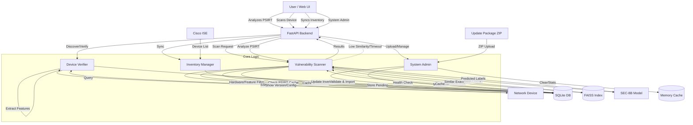
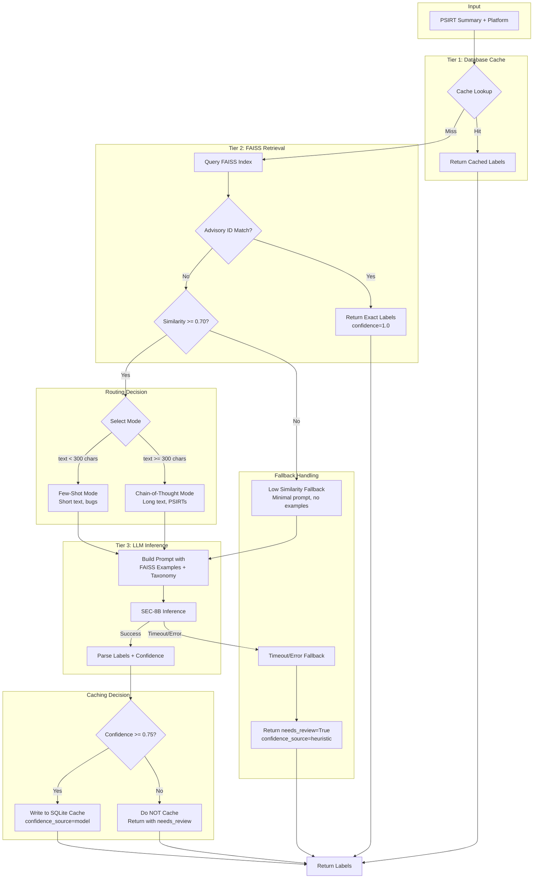
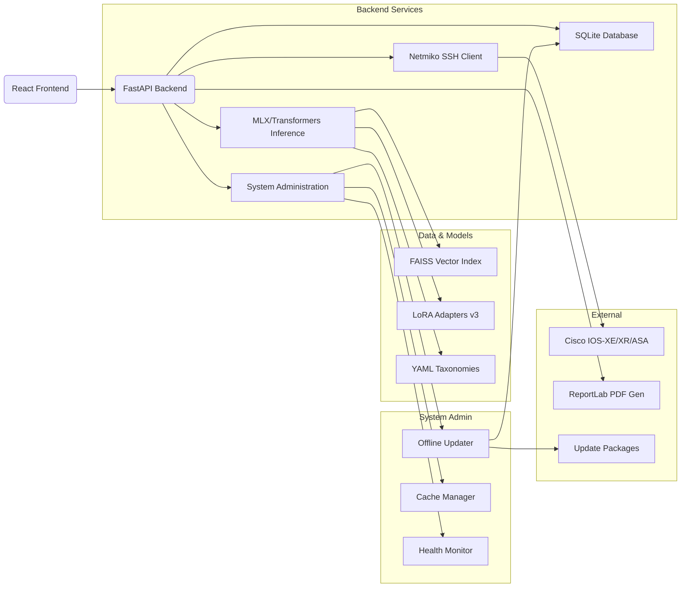
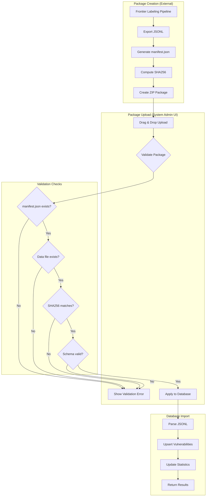
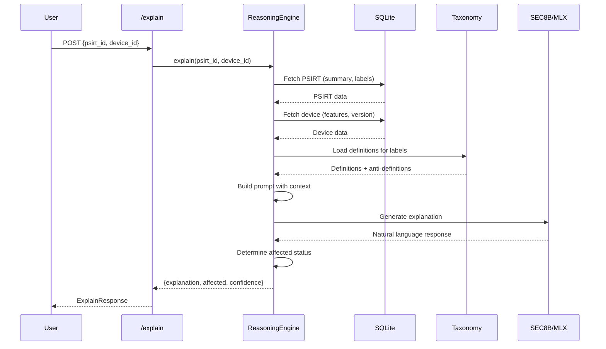

# CVE_EVAL_V2: Technical Analysis & Workflow Diagram

**Version:** 4.1 | **Last Updated:** December 19, 2025

> [!IMPORTANT]
> **MAINTENANCE REQUIREMENT**
> This document describes the critical architecture and workflow of the system.
> **IT MUST BE UPDATED** whenever the actual flow, dependencies, or architectural components of the project change.
> Failure to keep this document in sync with the code will lead to system degradation and confusion.

> **Version 3.0 Release:** See **[CHANGELOG_V3.md](CHANGELOG_V3.md)** for complete release notes, breaking changes, and migration guide.

## 1. System Overview
The **Cisco PSIRT Vulnerability Analysis & Device Verification System** is a dual-path tool designed to identify vulnerabilities in network devices. It combines a fast, database-driven scanner for known issues with an AI-powered analysis engine for new security advisories (PSIRTs).

### Architectual Highlights
- **Hybrid Approach**: Balances speed (DB lookup <10ms) with adaptability (LLM inference ~3s).
- **Production Ready**: Implements three-tier caching, hardware/feature filtering for false positive reduction, and extensive device support.
- **Deployment**: Supports Air-Gapped environments via Sidecar Extractor and Snapshots.

## 2. Critical Features & Components

| Feature | Description | Key Modules/Files |
| :--- | :--- | :--- |
| **Dual-Path Scanning** | Routes requests either to the local SQLite DB (Path A) or the SEC-8B LLM (Path B). | `backend/core/vulnerability_scanner.py` |
| **Unified Bug/PSIRT Scanning** | Database scanner queries both bugs and PSIRTs together, returns separate counts. PSIRTs require version data for accurate matching. | `backend/core/db_scanner.py` |
| **Feature-Aware Filtering** | Reduces false positives by checking effective config (features) against vulnerability requirements. | `backend/core/verifier.py`, `taxonomies/*.yml` |
| **Hardware Filtering** | Filters bugs based on hardware model (e.g., Cat9300 vs ASR1K). | `backend/core/db_scanner.py`, `backend/db` |
| **Device Inventory** | Manages device lifecycle: Sync from ISE -> Discover (SSH) -> Scan. | `backend/api/inventory_routes.py`, `backend/core/device_inventory.py` |
| **Air-Gapped Workflow** | Allows "Sidecar" feature extraction on secure nets, then offline verification via snapshot. | `sidecar_extractor/` |
| **AI Analysis** | Uses Foundation-Sec-8B (MLX/Transformers) to predict applicable features from PSIRT text. | `mlx_inference.py`, `backend/core/sec8b.py` |
| **AI Inference Modes** | Two routing modes: **Few-Shot** (short text/bugs, FAISS examples) and **Chain-of-Thought** (long text/PSIRTs, taxonomy definitions). Auto-selects based on text length (300 char threshold). | `mlx_inference.py`, `transformers_inference.py` |
| **Multi-Platform Adapters** | Platform-specific LoRA adapters: MLX (~71% accuracy) for Mac/MPS, PEFT/CUDA (~57% accuracy) for Linux. Auto-detection selects appropriate backend. | `models/adapters/`, `registry.yaml` |
| **Three-Tier Caching** | (1) Request-level dedup, (2) SQLite PSIRT cache with confidence tracking, (3) FAISS index for semantic retrieval. | `backend/core/vulnerability_scanner.py`, `vulnerability_db.sqlite` |
| **Fallback Handling** | Graceful degradation on FAISS low-similarity (<0.70), LLM timeout/error, or SSH failure. Returns `needs_review` flag instead of caching uncertain results. | `mlx_inference.py`, `backend/core/sec8b.py` |
| **System Administration** | Offline vulnerability database updates via ZIP packages, system health monitoring, database statistics, and cache management. Supports air-gapped deployments. | `backend/core/updater.py`, `backend/api/system_routes.py` |

## 3. Workflow Diagrams

### High-Level System Flow
This diagram illustrates the two main analysis paths and the inventory workflow. It reflects the prompt-building flow (FAISS retrieval before LLM) and the explicit fallback/cache behaviors.



### Path B: AI Analysis Flow (Detailed)
This diagram shows the detailed PSIRT analysis path with FAISS retrieval, routing modes, prompt building, and fallback handling.



### Dependency Map
Identification of where critical dependencies reside.



## 4. Dependencies & Location
*   **Database**: `vulnerability_db.sqlite` (Root)
    *   *Critical for*: Storing known bugs, PSIRT cache, Device Inventory.
*   **Taxonomies**: `taxonomies/features.yml` (and variants)
    *   *Critical for*: Mapping abstract labels to concrete CLI commands/Regex.
*   **Model Artifacts**: `models/`
    *   `labeled_examples.parquet`: Training data reference for few-shot learning.
    *   `faiss_index.bin`: Vector index for semantic similarity retrieval.
    *   `embedder_info.json`: **Required** - Sentence transformer configuration (model name, dimension, source).
    *   `adapters/`: Platform-specific LoRA adapters (see Section 4.1).
*   **Test Fixtures**: `tests/fixtures/`
    *   `psirt_corpus.json`: **Required** - Golden-path PSIRT test corpus for architecture testing.
*   **Python Dependencies**:
    *   `fastapi`, `uvicorn`: Web server.
    *   `mlx-lm`: AI inference (Mac/MPS).
    *   `transformers`, `peft`: AI inference (Linux/CUDA/CPU).
    *   `netmiko`: SSH connectivity.
    *   `faiss-cpu`: Vector search.

### 4.1 Multi-Platform Adapter Architecture

The system supports two hardware platforms with platform-specific LoRA adapters:

```
models/
├── adapters/
│   ├── mlx_v1/                    # Mac adapter (MLX format)
│   │   ├── adapter_config.json    # MLX adapter configuration
│   │   └── adapters.safetensors   # MLX weights (~20MB)
│   ├── cuda_v1/                   # Linux adapter (PEFT format)
│   │   ├── adapter_config.json    # PEFT adapter configuration
│   │   └── adapter_model.safetensors  # PEFT weights (~26MB)
│   └── registry.yaml              # Adapter metadata and defaults
├── embedder_info.json             # REQUIRED: Sentence transformer config
├── faiss_index.bin                # Shared: similarity search
└── labeled_examples.parquet       # Shared: few-shot examples
```

**embedder_info.json Schema:**
```json
{
  "model_name": "sentence-transformers/all-MiniLM-L6-v2",
  "dimension": 384,
  "num_examples": 7681,
  "source_file": "merged_with_silver_labels"
}
```

This file is **required** for FAISS similarity search and is loaded by:
- `fewshot_inference.py` (Linux/CUDA)
- `mlx_inference.py` (Mac/MPS)
- `scripts/build_faiss_index.py` (index generation)

| Platform | Framework | Adapter | Accuracy | Inference File |
|----------|-----------|---------|----------|----------------|
| Mac (MPS) | MLX | `mlx_v1/` | ~71% | `mlx_inference.py` |
| Linux (CUDA) | Transformers + PEFT | `cuda_v1/` | ~57% | `transformers_inference.py` |
| Linux (CPU) | Transformers + PEFT | `cuda_v1/` | ~57% | `transformers_inference.py` |

**Platform Detection Flow:**
```
Backend Startup
    │
    ├─► Mac (torch.backends.mps.is_available())
    │       └─► Use mlx_inference.py + mlx_v1 adapter
    │
    ├─► Linux/CUDA (torch.cuda.is_available())
    │       └─► Use transformers_inference.py + cuda_v1 adapter
    │
    └─► Linux/CPU (fallback)
            └─► Use transformers_inference.py + cuda_v1 adapter
```

**Adapter Registry (`registry.yaml`):**
```yaml
adapters:
  mlx_v1:
    path: models/adapters/mlx_v1
    platform: [mps]
    framework: mlx
    accuracy: 71.0

  cuda_v1:
    path: models/adapters/cuda_v1
    platform: [cuda, cpu]
    framework: peft
    accuracy: 57.6

defaults:
  mps: mlx_v1
  cuda: cuda_v1
  cpu: cuda_v1
```

**Important Notes:**
- Adapters are NOT interchangeable (different tensor formats)
- Shared data files (`faiss_index.bin`, `labeled_examples.parquet`, `vulnerability_db.sqlite`) work with both platforms
- PEFT library required on Linux: `pip install peft`

> **Troubleshooting:** For CUDA/Linux setup issues, see [SETUP_GUIDE.md#cudalinux-troubleshooting](SETUP_GUIDE.md#cudalinux-troubleshooting) for step-by-step verification and common error solutions.

## 5. Critical Files for Maintenance
1.  **`backend/core/vulnerability_scanner.py`**: The "brain" that decides between DB scan vs LLM analysis.
2.  **`backend/api/routes.py`**: Defines the public interface (PSIRT, scanning, export).
3.  **`backend/api/system_routes.py`**: System administration API (offline updates, health, cache).
4.  **`backend/core/device_inventory.py`**: Logic for ISE sync and device management.
5.  **`backend/core/updater.py`**: Offline vulnerability package import and validation.
6.  **`mlx_inference.py`**: AI inference for Mac/MPS (MLX backend, prompt construction, sampling).
7.  **`transformers_inference.py`**: AI inference for Linux/CUDA/CPU (Transformers + PEFT backend).

## 6. Fallbacks, Thresholds, and Caching Rules
> [!NOTE]
> **TARGET ARCHITECTURE**
> The following rules are defined by the Architecture Test Framework (`tests/architecture/`) and are being progressively implemented in the backend.
> See Section 9 for validation status.

### 6.1 Thresholds and Configuration

| Threshold | Default Value | Purpose | Config Location |
|-----------|---------------|---------|-----------------|
| FAISS Similarity | `0.70` | Below this, skip few-shot examples | `tests/conftest.py`, `mlx_inference.py` |
| Cache Confidence | `0.75` | Below this, do NOT cache result | `tests/conftest.py`, `backend/core/sec8b.py` |
| Mode Routing | `300 chars` | Below = Few-Shot, Above = CoT | `mlx_inference.py` |
| LLM Timeout | `30 seconds` | Max inference time before fallback | `backend/core/sec8b.py` |
| SSH Timeout | `10 seconds` | Max connection time per device | `backend/core/device_verifier.py` |

### 6.2 Fallback Behavior

- **FAISS low similarity (< 0.70)**:
  - Skip few-shot examples from FAISS retrieval
  - Run minimal heuristic prompt with taxonomy definitions only
  - Set `confidence_source=heuristic` in response
  - Consider returning `needs_review=True` if confidence < 0.75

- **LLM timeout/error**:
  - Return `needs_review=True` with `confidence_source=heuristic`
  - Do **NOT** cache the result (uncertain quality)
  - Log the error with request context for debugging
  - Return empty labels with error message in response

- **SSH discovery failure**:
  - Mark device as `discovery_status=failed` in inventory
  - Preserve last-known-good metadata (version, features, hardware)
  - Enqueue retry with exponential backoff (1min → 5min → 15min → 1hr)
  - After 3 failures, mark as `stale` requiring manual intervention

### 6.3 Caching Tiers (Explicit)

```
┌─────────────────────────────────────────────────────────────────┐
│                     TIER 1: Request Cache                        │
│  • In-memory deduplication within single API request             │
│  • Prevents duplicate FAISS/LLM calls for batch operations       │
│  • Lifetime: Single request                                      │
│  • Invalidation: Automatic (request ends)                        │
└─────────────────────────────────────────────────────────────────┘
                              ↓ Miss
┌─────────────────────────────────────────────────────────────────┐
│                    TIER 2: SQLite PSIRT Cache                    │
│  • Persistent storage for analyzed PSIRTs                        │
│  • Columns: advisory_id, platform, labels, confidence,           │
│             confidence_source (model|heuristic), needs_review    │
│  • Only caches if confidence >= 0.75 AND source = model          │
│  • Lifetime: Until explicit invalidation                         │
│  • Invalidation: PSIRT re-analysis, taxonomy change              │
└─────────────────────────────────────────────────────────────────┘
                              ↓ Miss
┌─────────────────────────────────────────────────────────────────┐
│                    TIER 3: FAISS Index                           │
│  • Semantic retrieval for few-shot prompt examples               │
│  • Contains embeddings of labeled training examples              │
│  • Returns: Similar examples + similarity scores                 │
│  • Exact Match: If advisory_id found, return labels directly     │
│  • Lifetime: Until model/LoRA update                             │
│  • Invalidation: LoRA update, taxonomy change (rebuild required) │
└─────────────────────────────────────────────────────────────────┘
```

### 6.4 Invalidation Rules

| Event | Tier 1 | Tier 2 (SQLite) | Tier 3 (FAISS) |
|-------|--------|-----------------|----------------|
| New request | Clear | - | - |
| PSIRT re-analyzed | - | Evict entry | - |
| LoRA/Model update | - | - | **Full rebuild** |
| Taxonomy change | - | Evict affected | Rebuild affected entries |
| Manual cache clear | - | Clear all | - |

### 6.5 Failure/Recovery Paths

```mermaid
flowchart TD
    subgraph "FAISS Failure Path"
        F1[FAISS Query] -->|Index corrupt/missing| F2[Log Error]
        F2 --> F3[Fall back to CoT mode<br/>No few-shot examples]
        F3 --> F4[Set needs_review=True]
    end

    subgraph "LLM Failure Path"
        L1[LLM Inference] -->|Timeout 30s| L2[Log Timeout]
        L1 -->|OOM/Crash| L3[Log Error]
        L2 --> L4[Return needs_review=True<br/>confidence_source=heuristic]
        L3 --> L4
        L4 --> L5[Do NOT cache result]
    end

    subgraph "SSH Failure Path"
        S1[SSH Connect] -->|Timeout 10s| S2[Mark device failed]
        S1 -->|Auth Error| S3[Log auth failure]
        S1 -->|Unreachable| S4[Mark device stale]
        S2 --> S5[Schedule retry<br/>exponential backoff]
        S3 --> S6[Require credential update]
        S4 --> S5
        S5 --> S7[After 3 retries:<br/>mark stale, alert]
    end

    subgraph "Cache Failure Path"
        C1[SQLite Write] -->|DB Locked| C2[Retry with backoff]
        C1 -->|Disk Full| C3[Log critical error]
        C2 -->|3 retries failed| C4[Skip cache, return result]
        C3 --> C5[Alert, continue without cache]
    end
```



### 6.6 Recovery Procedures

| Failure Type | Automatic Recovery | Manual Recovery |
|--------------|-------------------|-----------------|
| FAISS index corrupt | Fall back to CoT, log alert | Run `python scripts/build_faiss_index.py` |
| SQLite locked | Retry with backoff (3x) | Check for zombie processes, restart |
| LLM OOM | Return needs_review | Reduce batch size, check memory |
| SSH auth failure | Log, skip device | Update credentials in inventory |
| Model file missing | Fail startup with clear error | Re-download model, check paths |

## 7. Scanner Refactor Plan (Facade First)
- **Goal**: Keep `backend/core/vulnerability_scanner.py` as a stable facade while extracting responsibilities.
- **Target modules**:
  - `backend/core/db_scanner.py`: fast path, pure DB queries + hardware/feature filters.
  - `backend/core/ai_analyzer.py`: LLM path, prompt build, FAISS retrieval, thresholds, fallback handling.
  - `backend/core/scan_router.py`: decision logic (DB vs AI) and orchestration.
- **Migration steps (non-breaking)**:
  1) Extract shared logic into new modules; have `vulnerability_scanner.py` delegate to them.
  2) Keep existing public functions/signatures intact.
  3) Once stable and tested, update callers to import via the facade only; add deprecation warnings on direct internal imports if any remain.
- **Schema note**: Add `confidence_source` column/field to SQLite PSIRT cache for separating `model` vs `heuristic/needs_review`. Until applied, keep the flag in-memory and avoid caching heuristic results.

## 8. Observability Plan (Documentation-First)
- **Metrics to add**: LLM latency histogram, FAISS hit/miss and similarity distribution, cache hit/miss, confidence score distribution, model/LoRA version tag per prediction, SSH discovery latency/error counts.
- **Logging**: Structured logs for routing decision, similarity score, threshold used, fallback path taken, and cache write source (`model` vs `heuristic`).
- **Placement**: FastAPI middleware for request-level metrics; module-level metrics/logging in `db_scanner.py`, `ai_analyzer.py`, and `scan_router.py` after extraction.

## 9. Testing Workflow (Before/After, Iterative, Safety First)

> **Implementation:** The test framework for this workflow is located at `tests/architecture/`.
> See [`tests/architecture/README.md`](../tests/architecture/README.md) for detailed usage instructions.

- **Before refactor (baseline)**:
  - Run existing unit/integration tests.
  - Golden-path PSIRT inference check: sample PSIRT returns same labels/confidence.
  - FAISS retrieval sanity: ensure top-N results still returned for known query.
  - Device discovery/verification smoke: SSH mock/integration unchanged.
- **During refactor (per step)**:
  - Keep `vulnerability_scanner.py` facade green with delegations; add unit tests for `db_scanner.py`, `ai_analyzer.py`, `scan_router.py` as they appear.
  - Add tests for fallback behavior at the 0.70 threshold and for heuristic `needs_review` path (and ensure it is not cached).
  - Add regression test for cache invalidation: simulate LoRA update flag and assert FAISS rebuild call is triggered.
- **After refactor (comparison)**:
  - Diff outputs on a PSIRT sample set: pre/post labels and confidence match within tolerance.
  - Performance check: DB path remains ~<10ms; AI path stays within expected latency budget; no cache regressions.
  - Observability smoke: metric/log statements fire (can assert via test hooks or log captures).
- **Automation hooks**:
  - Add a small fixture PSIRT corpus and similarity fixtures to keep tests deterministic.
  - Provide a test helper to simulate FAISS low-similarity (<0.70) and LLM timeout to exercise fallbacks.
  - Gate schema changes (`confidence_source`) with migration plus migration test.

### 9.1 Required Test Fixtures

The architecture tests require the following fixture files:

```
tests/
├── fixtures/
│   └── psirt_corpus.json          # REQUIRED: Golden-path test PSIRTs
├── architecture/
│   ├── test_baseline.py           # Uses psirt_corpus fixture
│   ├── test_refactor.py           # Uses FAISSSimulator, LLMSimulator
│   ├── test_comparison.py         # Uses psirt_corpus for comparison
│   └── helpers.py                 # Platform-aware test helpers
└── unit/
    └── test_platform_detection.py # MLX/CUDA auto-detection tests
```

**psirt_corpus.json Schema:**
```json
{
  "description": "Golden-path PSIRT test corpus",
  "version": "1.0.0",
  "psirts": [
    {
      "id": "cisco-sa-example-001",
      "summary": "Vulnerability description...",
      "platform": "IOS-XE",
      "expected_labels": ["MGMT_SSH_HTTP"],
      "expected_confidence_min": 0.75,
      "notes": "Test case notes"
    }
  ],
  "bugs": [
    {
      "id": "CSCtest001",
      "summary": "Bug description...",
      "platform": "IOS-XE",
      "expected_labels": ["MGMT_SSH_HTTP"]
    }
  ]
}
```

This file is loaded by:
- `tests/architecture/helpers.py:load_psirt_corpus()`
- `tests/conftest.py:psirt_corpus` fixture

### 9.2 Cross-Platform Test Helpers

The test helpers in `tests/architecture/helpers.py` are platform-aware:

| Helper | Purpose | Platform Detection |
|--------|---------|-------------------|
| `get_inference_module()` | Returns correct inference module | `mlx_inference` (Mac) or `fewshot_inference` (Linux) |
| `FAISSSimulator` | Simulates low FAISS similarity | Auto-detects target module |
| `LLMSimulator` | Simulates LLM timeout/errors | Auto-detects target module |

**Example Usage:**
```python
# Automatically uses correct module for current platform
with FAISSSimulator.simulate_low_similarity():
    # Test fallback behavior
    pass

with LLMSimulator.simulate_timeout():
    # Test timeout handling
    pass
```

## 10. System Administration & Offline Updates

### 10.1 Offline Update Workflow
The system supports air-gapped deployments through offline vulnerability database updates via ZIP packages.



### 10.2 Update Package Format
Update packages are ZIP files containing:

```
update_package.zip
├── manifest.json          # Required: Package metadata
└── data.jsonl             # Required: Vulnerability data (JSONL format)
```

**manifest.json Schema:**
```json
{
  "file": "batch_results_v2_raw_validated_merged.jsonl",
  "sha256": "b421a1e762ddb917...",
  "pipeline_version": "1.0"
}
```

**JSONL Record Schema:**
```json
{
  "bug_id": "CSCxxx12345",
  "platform": "IOS-XE",
  "severity": 2,
  "headline": "Bug headline",
  "summary": "Full description...",
  "status": "Open",
  "affected_versions": "17.10.1 17.12.4",
  "labels": ["RTE_BGP", "SEC_CoPP"]
}
```

### 10.3 Hash Verification
The SHA256 hash provides **transfer integrity** (data wasn't corrupted during transfer), not source authenticity.

| Verification Type | Purpose | Implemented |
|-------------------|---------|-------------|
| Transfer Integrity | Detect corruption during file transfer | ✅ SHA256 in manifest |
| Source Authenticity | Verify package came from trusted source | ❌ (future: signed packages) |

**Behavior:**
- If manifest contains `sha256`: Verify data file hash matches
- If hash mismatch: Reject package with clear error
- If no hash found: Log warning, proceed (backwards compatibility)

### 10.4 System Health Monitoring
The System Admin UI provides real-time monitoring:

| Metric | Source | Purpose |
|--------|--------|---------|
| Database Size | SQLite file size | Monitor growth |
| Vulnerability Count | `vulnerabilities` table | Track coverage |
| Labeled Count | WHERE labels IS NOT NULL | Track label quality |
| By Platform | GROUP BY platform | Platform distribution |
| Cache Stats | In-memory caches | Monitor efficiency |

### 10.5 Cache Management
Three caches can be cleared via the UI:

| Cache | Purpose | Impact of Clear |
|-------|---------|-----------------|
| `psirt` | PSIRT analysis results | Re-analyze on next request |
| `scan` | Scan result cache | Re-scan on next request |
| `all` | All caches | Full cache rebuild |

**Note:** Clearing caches does NOT affect the SQLite database. Only in-memory caches are cleared.

## 11. AI Reasoning Layer

### 11.1 Evolution of the Local LLM Role

The system's architecture evolved through three phases:

```
Phase 1: "LLM labels PSIRTs" (core value proposition)
    ↓
Phase 2: "Frontier models label in batch, LLM is backup"
    ↓
Phase 3: "Database handles 95% of lookups, LLM provides reasoning"
```

With batch labeling via Frontier models achieving high accuracy and the offline update pipeline enabling air-gapped deployments, the local LLM's primary role shifted from **data producer** to **data interpreter**.

### 11.2 Why Reasoning Matters

| Capability | Batch Labeling | Local LLM Reasoning |
|------------|---------------|---------------------|
| Assign labels to PSIRTs | Primary | Backup only |
| Explain *why* a label applies | Cannot | Primary use |
| Generate device-specific remediation | Cannot | Primary use |
| Answer natural language questions | Cannot | Primary use |
| Prioritize risk for specific environment | Cannot | Primary use |
| Summarize vulnerability posture | Cannot | Primary use |

### 11.3 Architecture

```
┌─────────────────────────────────────────────────────────────────┐
│                        USER INTERFACE                           │
│  ┌──────────────┐ ┌──────────────┐ ┌──────────────┐            │
│  │   Explain    │ │  Remediate   │ │  Ask / Query │            │
│  │   Button     │ │   Button     │ │     Box      │            │
│  └──────────────┘ └──────────────┘ └──────────────┘            │
└─────────────────────────────────────────────────────────────────┘
                              │
                              ▼
┌─────────────────────────────────────────────────────────────────┐
│                    REASONING LAYER                              │
│  backend/api/reasoning_routes.py                                │
│  backend/core/reasoning_engine.py                               │
│                                                                 │
│  ┌─────────────┐ ┌─────────────┐ ┌─────────────┐ ┌────────────┐│
│  │  /explain   │ │ /remediate  │ │    /ask     │ │  /summary  ││
│  │ Why labels  │ │ CLI cmds +  │ │ NL query    │ │ Executive  ││
│  │ apply       │ │ options     │ │ interface   │ │ reports    ││
│  └──────┬──────┘ └──────┬──────┘ └──────┬──────┘ └─────┬──────┘│
│         │               │               │              │       │
│         └───────────────┴───────┬───────┴──────────────┘       │
│                                 │                               │
│                    ┌────────────▼────────────┐                 │
│                    │    ReasoningEngine      │                 │
│                    │  - Taxonomy Loader      │                 │
│                    │  - Prompt Builder       │                 │
│                    │  - Context Fetcher      │                 │
│                    └────────────┬────────────┘                 │
└─────────────────────────────────┼───────────────────────────────┘
                                  │
                                  ▼
┌─────────────────────────────────────────────────────────────────┐
│                   EXISTING INFRASTRUCTURE                        │
│  ┌──────────────┐  ┌──────────────┐  ┌──────────────┐          │
│  │   SQLite     │  │   SEC-8B     │  │  Taxonomy    │          │
│  │  Vuln DB     │  │   MLX/TF     │  │  YAML Files  │          │
│  └──────────────┘  └──────────────┘  └──────────────┘          │
└─────────────────────────────────────────────────────────────────┘
```

### 11.4 Data Flow: Explain Request



### 11.5 Performance Characteristics

| Operation | Latency | Notes |
|-----------|---------|-------|
| Taxonomy load | ~50ms | Once at startup, cached |
| DB context fetch | ~5ms | PSIRT + device lookup |
| Prompt construction | ~2ms | String operations |
| LLM inference | 2-4s | Depends on output length |
| Response parsing | ~5ms | Regex/JSON extraction |
| **Total /explain** | **2-4s** | End-to-end |
| **Total /remediate** | **3-5s** | More complex prompt |
| **Total /ask** | **3-6s** | Query routing overhead |
| **Total /summary** | **5-10s** | Multi-PSIRT aggregation |

### 11.6 Intent Classification (for /ask)

The `/ask` endpoint uses a **3-tier hybrid classification** approach for robust query routing:

```
┌─────────────────────────────────────────────────────────────────┐
│                   TIER 1: Quick Override (~0ms)                  │
│  • Keyword combinations that clearly indicate intent             │
│  • "device" + severity → DEVICES_BY_RISK                        │
│  • "recommend/prioriti" → PRIORITIZE                            │
│  • Device name + bug words → DEVICE_VULNERABILITIES             │
└─────────────────────────────────────────────────────────────────┘
                              ↓ No match
┌─────────────────────────────────────────────────────────────────┐
│                   TIER 2: Keyword Scoring (~1ms)                 │
│  • Scores ALL intents based on keyword matches                  │
│  • Considers: requires_all, requires_any, excludes, weights     │
│  • Picks highest score with confidence based on margin          │
│  • High confidence (score >= 15 or margin >= 5): Use directly   │
│  • Medium confidence (score >= 5): Use with lower confidence    │
│  • Low confidence (margin < 3): Fall through to LLM             │
└─────────────────────────────────────────────────────────────────┘
                              ↓ Ambiguous
┌─────────────────────────────────────────────────────────────────┐
│                   TIER 3: LLM Classification (~1-2s)             │
│  • SEC-8B classifies ambiguous queries                          │
│  • Returns QueryIntent from constrained category set            │
│  • Only invoked when scoring produces low confidence            │
└─────────────────────────────────────────────────────────────────┘
```

**Supported Intents:**

| Intent | Example Queries | Handler |
|--------|-----------------|---------|
| PRIORITIZE | "what should I focus on?", "recommendations?" | `_handle_prioritize()` |
| DEVICES_BY_RISK | "which devices have critical bugs?" | `_handle_devices_by_risk()` |
| DEVICE_VULNERABILITIES | "what bugs affect C9200L?" | `_handle_device_vulnerabilities()` |
| LIST_DEVICES | "show my devices" | `_handle_list_devices()` |
| LIST_VULNERABILITIES | "show me critical bugs" | `_handle_list_vulnerabilities()` |
| EXPLAIN_VULNERABILITY | "explain cisco-sa-..." | `_handle_explain_query()` |
| EXPLAIN_LABEL | "what does SEC_CoPP mean" | `_handle_label_query()` |
| REMEDIATION | "how do I fix..." | `_handle_remediation_query()` |
| COUNT | "how many vulnerabilities" | `_handle_count_query()` |
| SUMMARY | "give me a summary" | `_handle_summary_query()` |
| UNKNOWN | (no match) | `_handle_freeform_query()` |

**Keyword Scoring Configuration:**

| Intent | Keywords | Requirements | Weight |
|--------|----------|--------------|--------|
| DEVICES_BY_RISK | device, switch, router | Must have device AND severity word | 5 |
| DEVICE_VULNERABILITIES | bug, vuln, affect | Must have device word or name pattern | 4 |
| LIST_VULNERABILITIES | bug, vuln, critical | Cannot have device words | 3 |
| PRIORITIZE | recommend, priorit, focus | - | 3 |

**Benefits of 3-Tier Approach:**
- **Robustness**: "devices has critical bugs" (grammar error) routes correctly
- **Speed**: 95%+ of queries classified instantly (Tier 1 or 2)
- **Accuracy**: LLM handles edge cases that scoring can't resolve
- **No prompt leakage**: Freeform handler provides guidance, not raw LLM output

### 11.7 Key Files

| File | Purpose |
|------|---------|
| `backend/api/reasoning_routes.py` | API endpoint definitions |
| `backend/core/reasoning_engine.py` | Core reasoning logic |
| `taxonomies/*.yml` | Label definitions for prompts |

### 11.8 Fine-Tuning Value Retention

The LoRA adapter training remains critical because the model learned:

| Training Signal | Reasoning Application |
|-----------------|----------------------|
| Taxonomy definitions + anti-definitions | "Why does this label apply / not apply?" |
| PSIRT text → label mappings | "What features are affected?" |
| Config patterns → feature detection | "Is this device running the vulnerable feature?" |
| Chain-of-thought reasoning | "Walk me through the analysis" |

A base Llama model would hallucinate on Cisco-specific terminology. The fine-tuned Foundation-Sec-8B understands what `SEC_CoPP`, `MGMT_SSH_HTTP`, and `RTE_BGP` mean in context.
