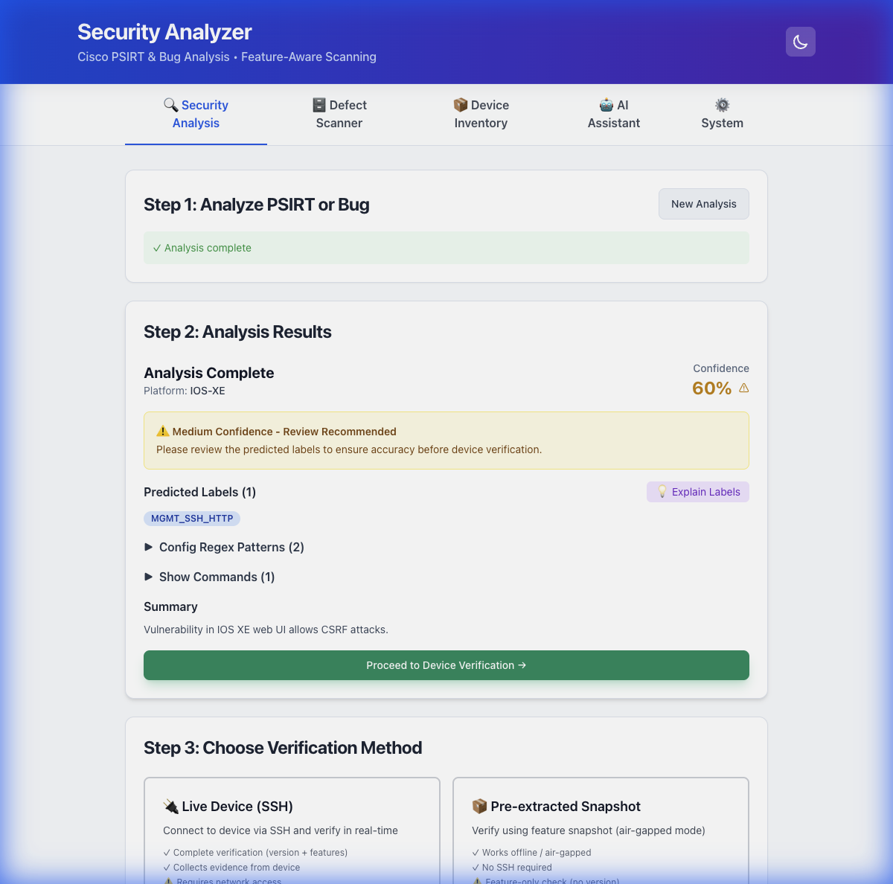
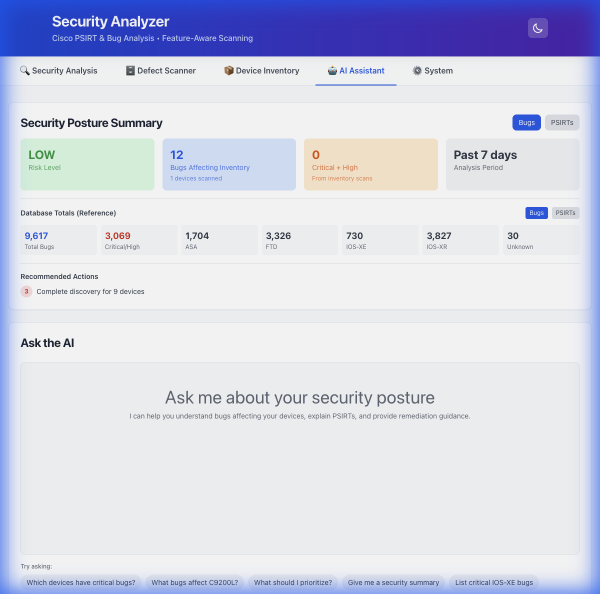

# Visual Lead Guide: Mastering CVE_EVAL_V2

This guide walks you through the "flow" of the application, showing you exactly how to leverage its dual-engine architecture.

## The Core Concept: Two Engines, Two Paths

Understanding this single concept enables you to use the tool effectively:
*   **Path A (Proactive/Known):** Use the **Defect Scanner** when you have structured data (versions, specific hardware). Example: "Can I upgrade to 17.10.1?"
*   **Path B (Reactive/Unknown):** Use **Security Analysis** when you have unstructured text (emails, advisories). Example: "Am I vulnerable to this new thing?"

---

## Path 1: The Reactive Flow (Security Analysis)
**Scenario:** You receive a generic security advisory email. "Critical vulnerability in IOS XE Web UI...".

**Step 1:** Navigate to the **Security Analysis** tab.
**Step 2:** Paste the raw text into the summary box.
**Step 3:** Click **Analyze**.

**Leverage Point:**
*   Notice how the tool extracts **Features** (e.g., `SEC_HTTP`, `MGMT_SSH`).
*   **Action:** Immediately click "Verify Device" (below the analysis results) to check if *your* specific device has these features enabled.

---

## Path 2: The Proactive Flow (Defect Scanner)
**Scenario:** You are planning a fleet upgrade or checking compliance.

**Step 1:** Click the **Defect Scanner** tab.
**Step 2:** Select your Platform (e.g., **IOS-XE**) and Version (e.g., **17.9.2**).
**Step 3:** **CRITICAL:** Select your Hardware Model (e.g., **Cat9300**).

> [!TIP]
> **Hardware Filtering** is your biggest time-saver. By specifying "Cat9300", you filter out ~25% of bugs that only apply to ASR or ISR routers, even if they run the same software version.

**Step 4:** (Advanced) Use **Feature Mode**. Upload a `show running-config` snapshot. The scanner will mathematically verify which bugs apply to your configuration, often reducing the "bug count" from ~300 to <50 relevant issues.

---

## Path 3: The Analyst Flow (AI Assistant)
**Scenario:** You need a high-level summary for leadership or want to understand *why* a device is vulnerable.

**Step 1:** Click the **AI Assistant** tab.
**Step 2:** Review the **Security Posture Summary** (top dashboard).

**Leverage Point:**
*   **Natural Language Queries:** Don't just look at the charts. Ask questions like:
    *   *"Which devices are most critical right now?"*
    *   *"Explain why 'CSCwd12345' is marked as affecting my C9300."*
*   The AI uses the **Reasoning Engine** to traverse the graph of Device -> Features -> Vulnerability -> Taxonomy to give you a causal explanation.

---

## Path 4: The Manager Flow (Device Inventory)
**Scenario:** keeping your "Source of Truth" accurate.

**Step 1:** Click **Device Inventory**.
**Step 2:** **Sync from ISE** (if available) or Import CSV.
**Step 3:** **Run SSH Discovery**.

> [!IMPORTANT]
> **SSH Discovery** is the foundation of the entire system. It extracts the "Feature Profile" of your devices. Without this, you are only matching against Version (Path A), skipping the powerful Feature Filtering. Run this after any major config change.

---

## Summary Checklist

| If you have... | Use Tab... |
| :--- | :--- |
| A text advisory / email | **Security Analysis** |
| A version number (17.x.x) | **Defect Scanner** |
| A list of devices in ISE | **Device Inventory** |
| A question ("Why...?") | **AI Assistant** |
| A need to update the DB | **System Admin** (Offline Update) |
